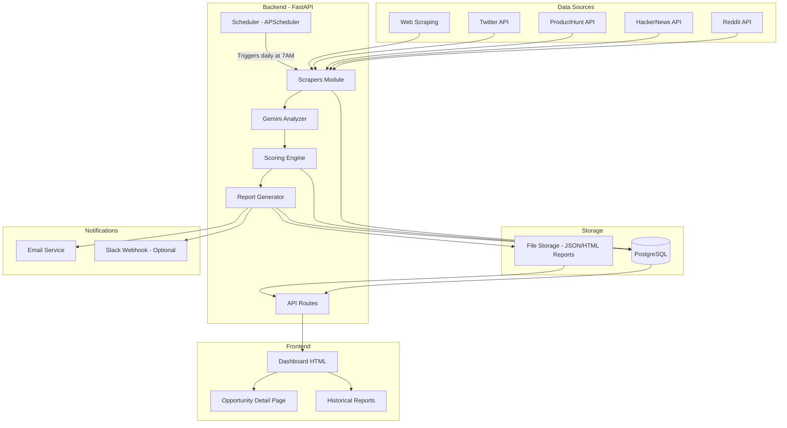
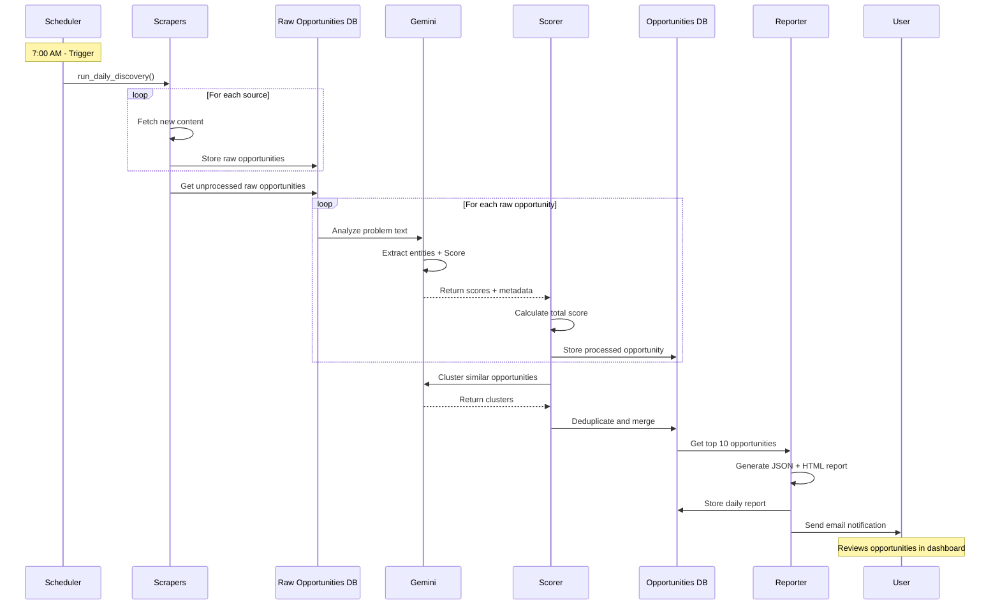
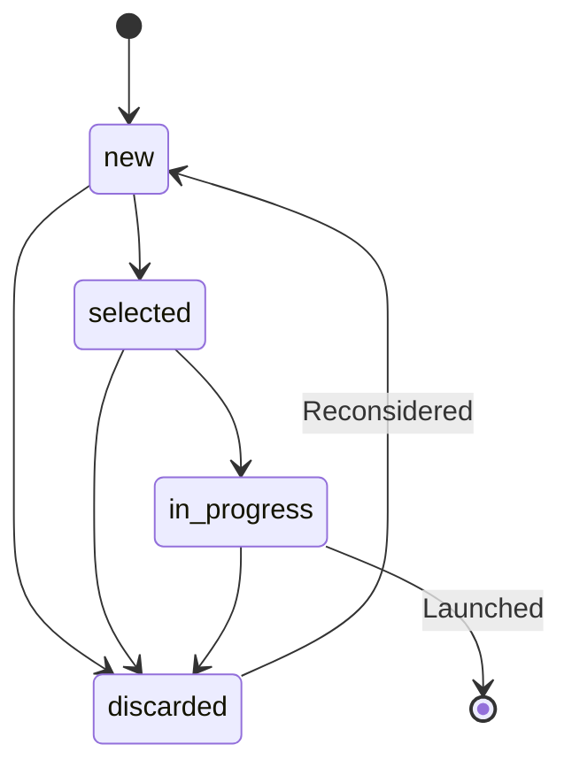

# Plan de Oportunidades de Negocio Diarias

## Resumen Ejecutivo

Este documento define la arquitectura y estrategia de implementación para un sistema automatizado que descubre, analiza y presenta diariamente las 10 mejores oportunidades de negocio para crear aplicaciones SaaS, herramientas, automatizaciones o micro-servicios con IA.

El sistema utilizará **Gemini 3** para análisis semántico avanzado, múltiples fuentes de información pública, y un modelo de puntuación multi-criterio para identificar oportunidades de alto valor con disposición a pagar.

---

## 1. Objetivo Principal y Usuario

### Objetivo
Encontrar **todos los días 10 oportunidades de negocio de alta calidad** donde tenga sentido construir una aplicación (SaaS, automatización, integración o agente IA) que se pueda vender con modelo de suscripción mensual.

### Usuario Objetivo
**Emprendedor / freelancer técnico** con experiencia en:
- Automatización (Make.com, Zapier, Apps Script)
- Desarrollo web y API
- Implementación de agentes IA
- Búsqueda de productos validados para construir y vender

### Frecuencia de Ejecución
- **Ejecución diaria automática** (programada para ejecutarse cada mañana a las 7:00 AM)
- Generación de un **informe diario** con 10 oportunidades priorizadas
- Almacenamiento del histórico para análisis de tendencias

---

## 2. Fuentes de Información

### Estrategia de Captura de Datos

El sistema consultará múltiples fuentes públicas siguiendo buenas prácticas y respetando términos de uso:

#### A) **Foros de Problemas Técnicos y de Usuarios**

| Fuente | Método de Acceso | Datos a Extraer | Frecuencia |
|--------|------------------|-----------------|------------|
| Reddit (vía API oficial) | Reddit API (OAuth2) | Posts de subreddits como r/Entrepreneur, r/smallbusiness, r/SaaS, r/nocode | Diario |
| ProductHunt | API pública o RSS feeds | Productos lanzados, comentarios sobre necesidades no cubiertas | Diario |
| Indie Hackers | Web scraping ético (robots.txt) | Discusiones sobre problemas de negocio | Diario |
| HackerNews | Firebase API oficial | Posts tipo "Ask HN" sobre problemas y necesidades | Diario |

**Datos extraídos:**
- Descripción del problema o "pain point"
- Sector/industria mencionada
- Herramientas actuales usadas (y sus limitaciones)
- Indicadores de urgencia ("need ASAP", "costing us $X/month")
- Número de upvotes/engagement (validación social)

#### B) **Comunidades de Automatización y Low-Code**

| Fuente | Método de Acceso | Datos a Extraer | Frecuencia |
|--------|------------------|-----------------|------------|
| Make.com Community | Web scraping ético | Preguntas tipo "¿cómo automatizar X?" | Diario |
| Zapier Community | API o scraping | Problemas recurrentes sin solución nativa | Diario |
| n8n Forum | RSS / API si disponible | Workflows manuales que la gente quiere automatizar | Diario |

**Datos extraídos:**
- Proceso manual a automatizar
- Frecuencia del problema (veces mencionado)
- Integraciones deseadas
- Nivel de frustración del usuario

#### C) **Listados de Trabajos Repetitivos**

| Fuente | Método de Acceso | Datos a Extraer | Frecuencia |
|--------|------------------|-----------------|------------|
| Upwork/Fiverr (búsquedas públicas) | Scraping de resultados públicos | Trabajos repetitivos muy demandados | Semanal |
| LinkedIn Jobs | Búsquedas públicas | Puestos dedicados a tareas manuales automatizables | Semanal |

**Datos extraídos:**
- Tipo de tarea manual
- Sector de la empresa
- Frecuencia de publicación de ofertas similares
- Rango salarial (indica disposición a pagar por solución)

#### D) **Tendencias y Noticias**

| Fuente | Método de Acceso | Datos a Extraer | Frecuencia |
|--------|------------------|-----------------|------------|
| Google News API | API oficial | Noticias sobre ineficiencias empresariales | Diario |
| Twitter API | API oficial (v2) | Quejas recurrentes de empresas/profesionales | Diario |

**Datos extraídos:**
- Procesos manuales mencionados en noticias
- Cambios regulatorios que crean nueva fricción
- Adopción de nuevas tecnologías (ej: "migración a X requiere Y manual")

### Buenas Prácticas de Captura

> [!IMPORTANT]
> **Cumplimiento de Términos de Uso**
> - Usar **APIs oficiales** siempre que estén disponibles
> - Respetar `robots.txt` y políticas de rate limiting
> - No almacenar datos personales identificables (PII)
> - Incluir `User-Agent` identificable en todas las peticiones
> - Implementar backoff exponencial en caso de errores 429

---

## 3. Modelo de Evaluación y Puntuación

### Criterios de Puntuación (0-10 cada uno)

#### 1. **Dolor y Urgencia del Problema** (Peso: 30%)
- **10 puntos:** Problema crítico con impacto económico directo ("perdemos X$/día")
- **7-9 puntos:** Problema significativo con frustración clara
- **4-6 puntos:** Inconveniente notable pero no bloqueante
- **1-3 puntos:** "Nice to have" sin urgencia
- **0 puntos:** No se percibe dolor real

**Indicadores clave para Gemini 3:**
- Palabras de urgencia: "urgent", "critical", "losing money", "desperate"
- Cuantificación del impacto: menciones de costes, tiempo perdido
- Tono emocional del texto (frustración, desesperación)

#### 2. **Frecuencia del Problema** (Peso: 20%)
- **10 puntos:** Problema mencionado 50+ veces en última semana
- **7-9 puntos:** 20-49 menciones
- **4-6 puntos:** 10-19 menciones
- **1-3 puntos:** 3-9 menciones
- **0 puntos:** Mención única o aislada

**Método de cálculo:**
- Clustering semántico de problemas similares usando embeddings de Gemini
- Conteo de menciones agrupadas por problema normalizado

#### 3. **Disposición a Pagar / Impacto Económico** (Peso: 20%)
- **10 puntos:** Evidencia clara de presupuesto (ofertas de trabajo >$50k/año, menciones de costes altos)
- **7-9 puntos:** Sector con alto poder adquisitivo (fintech, healthcare, legal)
- **4-6 puntos:** Mención de disposición a pagar solución
- **1-3 puntos:** Sector con presupuestos limitados
- **0 puntos:** Segmento no monetizable (estudiantes, hobbyistas)

**Indicadores clave:**
- Menciones de presupuesto o ROI esperado
- Sector de la industria
- Tamaño de empresa (SMB vs Enterprise)

#### 4. **Nivel de Competencia** (Peso: 15%, invertido)
- **10 puntos:** Problema sin solución existente clara (búsquedas muestran 0-2 competidores)
- **7-9 puntos:** Soluciones existentes con reviews bajas o quejas recurrentes
- **4-6 puntos:** Mercado con 3-5 competidores pero oportunidad de diferenciación
- **1-3 puntos:** Mercado saturado pero con nichos sin cubrir
- **0 puntos:** Mercado dominado por gigantes (Google, Microsoft, etc.)

**Método de evaluación:**
- Búsqueda automática en Google de "[problema] SaaS solution"
- Análisis de resultados con Gemini 3
- Review de ratings en ProductHunt/Capterra si existen soluciones

#### 5. **Facilidad Técnica de Implementación** (Peso: 10%)
- **10 puntos:** MVP posible en 1-2 semanas con APIs y no-code/low-code
- **7-9 puntos:** MVP en 1 mes con stack estándar (Node.js/Python + DB + APIs conocidas)
- **4-6 puntos:** Requiere aprendizaje de 1-2 tecnologías nuevas
- **1-3 puntos:** Requiere expertise especializado (ML, blockchain, hardware)
- **0 puntos:** Técnicamente imposible para un solo desarrollador

**Factores de evaluación:**
- Disponibilidad de APIs para integraciones necesarias
- Complejidad del modelo de datos
- Requisitos de infraestructura

#### 6. **Sinergia con Automatización y Agentes IA** (Peso: 5%)
- **10 puntos:** Perfect fit para solución IA/automatización (ej: procesamiento de texto, análisis de datos)
- **7-9 puntos:** Componentes clave automáticamente con IA
- **4-6 puntos:** IA puede mejorar la experiencia
- **1-3 puntos:** Solución principalmente manual con poca automatización
- **0 puntos:** No aplicable para IA/automatización

### Fórmula de Puntuación Total

```
Score_Total = 
  (0.30 × Dolor) + 
  (0.20 × Frecuencia) + 
  (0.20 × DisposiciónAPagar) + 
  (0.15 × BajaCompetencia) + 
  (0.10 × FacilidadTécnica) + 
  (0.05 × SinergiaIA)

Rango: 0.0 - 10.0
```

### Normalización de Puntuaciones

Cada criterio será evaluado por **Gemini 3** usando análisis semántico:

1. **Extracción de features** del texto fuente
2. **Prompt estructurado** a Gemini 3 solicitando puntuación justificada
3. **Validación** de que la puntuación está en rango 0-10
4. **Agregación** según fórmula de pesos

**Ejemplo de prompt para Gemini 3:**
```
Analiza el siguiente problema de negocio y puntúalo de 0 a 10 en estas dimensiones:
- Dolor y urgencia
- Frecuencia (estimada basándote en la formulación)
- Disposición a pagar (basándote en sector mencionado)
- Facilidad técnica de implementación
- Sinergia con IA/automatización

Problema: "{texto_del_problema}"
Sector: "{sector}"
Fuente: "{fuente}"

Devuelve la respuesta en formato JSON con justificaciones breves.
```

---

## 4. Formato de Salida Diaria

### Estructura del Informe

Cada día, el sistema generará un informe con esta estructura:

#### A) **Formato JSON Estructurado**

```json
{
  "fecha": "2025-12-01",
  "version": "1.0",
  "oportunidades": [
    {
      "id": "opp_20251201_001",
      "ranking": 1,
      "titulo": "Automatización de Facturación para Clínicas Dentales",
      "descripcion_problema": "Clínicas gastan 10+ horas semanales creando facturas manualmente desde diferentes sistemas (agenda, inventario, seguros). Errores frecuentes causan retrasos en cobros.",
      "sector": "Healthcare - Clínicas Dentales",
      "tipo_solucion": "SaaS Web + Integraciones",
      "propuesta_app": {
        "nombre_sugerido": "DentalBiller Pro",
        "descripcion": "Plataforma que integra con software de agenda dental (OpenDental, Dentrix) y genera facturas automáticas, enviándolas por email/WhatsApp y sincronizando con contabilidad.",
        "features_clave": [
          "Integración con 5+ software de clínicas dentales",
          "Generación automática de facturas en PDF",
          "Envío automatizado por email/WhatsApp",
          "Dashboard de cobros pendientes",
          "Integración con Stripe/PayPal para pagos online"
        ],
        "modelo_negocio": "Suscripción mensual: $49-199/mes según tamaño clínica",
        "mvp_estimado": "3-4 semanas"
      },
      "usuarios_ideales": {
        "perfil": "Propietarios de clínicas dentales de 1-5 consultas",
        "tamano_mercado": "150,000+ clínicas en España/LATAM",
        "capacidad_pago": "Alta (servicios médicos, alto ticket)"
      },
      "beneficio_economico": {
        "ahorro_tiempo": "10 horas/semana (valoradas en ~€250/semana)",
        "reduccion_errores": "Estimado 30% menos errores de facturación",
        "rango_precio_suscripcion": "€49-199/mes",
        "ltv_estimado": "€1,200-3,600/cliente (suponiendo 24 meses retención)"
      },
      "puntuacion": {
        "total": 8.65,
        "desglose": {
          "dolor": 9.0,
          "frecuencia": 8.5,
          "disposicion_pagar": 9.0,
          "baja_competencia": 7.0,
          "facilidad_tecnica": 8.0,
          "sinergia_ia": 9.5
        }
      },
      "fuentes": [
        {
          "tipo": "reddit",
          "url": "https://reddit.com/r/Dentistry/comments/xyz",
          "fecha_deteccion": "2025-11-30",
          "extracto": "\"We waste SO much time on billing... our current system doesn't talk to our scheduler and we have to enter everything twice\"",
          "engagement": "45 upvotes, 23 comentarios"
        },
        {
          "tipo": "indie_hackers",
          "url": "https://indiehackers.com/post/abc",
          "fecha_deteccion": "2025-11-29",
          "extracto": "Looking for a dental billing solution that actually integrates...",
          "engagement": "12 comentarios"
        }
      ],
      "tags": ["healthcare", "billing", "automation", "saas", "integrations"],
      "fecha_creacion": "2025-12-01T07:15:32Z"
    }
    // ... 9 oportunidades más
  ],
  "metadata": {
    "fuentes_consultadas": 15,
    "total_problemas_analizados": 247,
    "tiempo_ejecucion_minutos": 12.5,
    "modelo_usado": "gemini-3.0-pro"
  }
}
```

#### B) **Resumen HTML Legible**

Además del JSON, se generará un **email HTML** diario con:

- Header con fecha y resumen ejecutivo
- Top 10 oportunidades en formato de tarjetas
- Para cada oportunidad:
  - Título destacado
  - Puntuación visual (estrellas o barra de progreso)
  - Descripción breve (100-150 palabras)
  - Iconos para sector y tipo de solución
  - Botones de acción: "Ver detalle", "Marcar interesante", "Descartar"

#### C) **Notificación Diaria**

- Email enviado cada mañana a las 7:30 AM
- Opcionalmente: notificación push si se crea app móvil
- Opcionalmente: webhook a Slack/Discord

---

## 5. Arquitectura Técnica

### Stack Tecnológico Propuesto

Dado que el usuario trabaja principalmente en **Windows 11** y navegador, y tiene experiencia con automatización:

#### Backend

**Opción Recomendada: Python + FastAPI**

**Justificación:**
- El usuario ya tiene experiencia con FastAPI (conversación previa confirmada)
- Excelente ecosistema de scraping (BeautifulSoup, Scrapy, requests)
- Librerías robustas para APIs (httpx, aiohttp para async)
- Integración nativa con Gemini 3 Python SDK
- Fácil deployment (Docker, Railway, Render)

**Estructura del proyecto:**
```
business-opportunities-finder/
├── backend/
│   ├── app/
│   │   ├── main.py                 # FastAPI app
│   │   ├── config.py               # Configuración y secrets
│   │   ├── models/
│   │   │   ├── opportunity.py      # Modelo de oportunidad
│   │   │   ├── source.py           # Modelo de fuente
│   │   │   └── scoring.py          # Criterios y pesos
│   │   ├── services/
│   │   │   ├── scrapers/
│   │   │   │   ├── reddit_scraper.py
│   │   │   │   ├── hn_scraper.py
│   │   │   │   ├── ph_scraper.py
│   │   │   │   └── base_scraper.py
│   │   │   ├── gemini_analyzer.py  # Integración con Gemini 3
│   │   │   ├── scorer.py           # Sistema de puntuación
│   │   │   └── report_generator.py # Generación de informes
│   │   ├── database/
│   │   │   ├── db.py               # Configuración SQLAlchemy
│   │   │   └── migrations/         # Alembic migrations
│   │   ├── scheduler/
│   │   │   └── daily_job.py        # Tarea programada diaria
│   │   └── api/
│   │       └── routes/
│   │           ├── opportunities.py # Endpoints de oportunidades
│   │           ├── sources.py      # Endpoints de fuentes
│   │           └── reports.py      # Endpoints de informes
│   ├── tests/
│   ├── requirements.txt
│   └── Dockerfile
├── frontend/
│   ├── index.html                  # Dashboard principal
│   ├── css/
│   │   └── styles.css
│   ├── js/
│   │   ├── app.js                  # Lógica principal
│   │   ├── api.js                  # Cliente API
│   │   └── components/
│   │       ├── opportunity-card.js
│   │       └── filters.js
│   └── assets/
├── .env.example
├── docker-compose.yml
└── README.md
```

#### Base de Datos

**Opción Recomendada: PostgreSQL**

**Justificación:**
- Soporte nativo para JSON (almacenar análisis completo de Gemini)
- Full-text search para búsqueda de oportunidades
- Robusto y escalable
- Fácil de configurar con Docker en Windows

**Esquema de datos:**

```sql
-- Tabla de fuentes
CREATE TABLE sources (
    id SERIAL PRIMARY KEY,
    name VARCHAR(100) NOT NULL,
    type VARCHAR(50) NOT NULL,  -- 'reddit', 'hn', 'producthunt', etc.
    url TEXT NOT NULL,
    config JSONB,  -- Configuración específica (API keys, subreddits, etc.)
    active BOOLEAN DEFAULT TRUE,
    last_scraped_at TIMESTAMP,
    created_at TIMESTAMP DEFAULT CURRENT_TIMESTAMP
);

-- Tabla de problemas/oportunidades raw
CREATE TABLE raw_opportunities (
    id SERIAL PRIMARY KEY,
    source_id INTEGER REFERENCES sources(id),
    external_id VARCHAR(255),  -- ID en la fuente original
    title TEXT,
    description TEXT,
    url TEXT,
    metadata JSONB,  -- Datos adicionales (upvotes, comments, etc.)
    detected_at TIMESTAMP DEFAULT CURRENT_TIMESTAMP,
    processed BOOLEAN DEFAULT FALSE,
    UNIQUE(source_id, external_id)
);

-- Tabla de oportunidades procesadas y puntuadas
CREATE TABLE opportunities (
    id SERIAL PRIMARY KEY,
    public_id VARCHAR(50) UNIQUE NOT NULL,  -- ej: 'opp_20251201_001'
    title VARCHAR(255) NOT NULL,
    problem_description TEXT NOT NULL,
    sector VARCHAR(100),
    solution_type VARCHAR(100),
    proposed_app JSONB,  -- Objeto con propuesta de app
    ideal_users JSONB,
    economic_benefit JSONB,
    score_total DECIMAL(4,2),
    score_breakdown JSONB,  -- Desglose de puntuaciones
    tags TEXT[],
    status VARCHAR(50) DEFAULT 'new',  -- 'new', 'selected', 'discarded', 'in_progress'
    user_notes TEXT,
    created_at TIMESTAMP DEFAULT CURRENT_TIMESTAMP,
    updated_at TIMESTAMP DEFAULT CURRENT_TIMESTAMP
);

-- Tabla de relación oportunidades <-> raw opportunities
CREATE TABLE opportunity_sources (
    opportunity_id INTEGER REFERENCES opportunities(id),
    raw_opportunity_id INTEGER REFERENCES raw_opportunities(id),
    PRIMARY KEY (opportunity_id, raw_opportunity_id)
);

-- Tabla de informes diarios
CREATE TABLE daily_reports (
    id SERIAL PRIMARY KEY,
    report_date DATE UNIQUE NOT NULL,
    top_opportunities INTEGER[],  -- IDs de las 10 oportunidades seleccionadas
    report_json JSONB,
    report_html TEXT,
    sources_consulted INTEGER,
    total_analyzed INTEGER,
    execution_time_minutes DECIMAL(5,2),
    created_at TIMESTAMP DEFAULT CURRENT_TIMESTAMP
);

-- Tabla de configuración de scoring
CREATE TABLE scoring_config (
    id SERIAL PRIMARY KEY,
    version VARCHAR(20) NOT NULL,
    weights JSONB NOT NULL,  -- Pesos de cada criterio
    active BOOLEAN DEFAULT TRUE,
    created_at TIMESTAMP DEFAULT CURRENT_TIMESTAMP
);

-- Índices para rendimiento
CREATE INDEX idx_opportunities_date ON opportunities(created_at DESC);
CREATE INDEX idx_opportunities_score ON opportunities(score_total DESC);
CREATE INDEX idx_opportunities_status ON opportunities(status);
CREATE INDEX idx_raw_opportunities_source ON raw_opportunities(source_id);
CREATE INDEX idx_raw_opportunities_processed ON raw_opportunities(processed);
```

#### Programación de Tareas

**Opción Recomendada: APScheduler (Python)**

**Justificación:**
- Integración nativa con aplicaciones Python/FastAPI
- No requiere cron externo (funciona en Windows)
- Soporte para jobs persistentes en DB
- Fácil de testear y debuggear

**Configuración:**
```python
from apscheduler.schedulers.asyncio import AsyncIOScheduler
from apscheduler.triggers.cron import CronTrigger

scheduler = AsyncIOScheduler()

# Ejecutar todos los días a las 7:00 AM
scheduler.add_job(
    run_daily_discovery,
    trigger=CronTrigger(hour=7, minute=0),
    id='daily_discovery',
    replace_existing=True
)

scheduler.start()
```

#### Scraping y Consumo de APIs

**Herramientas:**

| Fuente | Librería | Autenticación Requerida |
|--------|----------|-------------------------|
| Reddit | PRAW (Python Reddit API Wrapper) | OAuth2 (API gratuita) |
| HackerNews | httpx + Firebase API | No requiere auth |
| ProductHunt | httpx + API oficial | API key gratuita |
| Twitter/X | tweepy | API key (tier gratuito limitado) |
| Web scraping general | BeautifulSoup4 + httpx | No |

**Rate limiting y backoff:**
```python
from tenacity import retry, wait_exponential, stop_after_attempt

@retry(
    wait=wait_exponential(multiplier=1, min=4, max=60),
    stop=stop_after_attempt(5)
)
async def fetch_with_retry(url, headers):
    async with httpx.AsyncClient() as client:
        response = await client.get(url, headers=headers)
        response.raise_for_status()
        return response.json()
```

#### Integración con Gemini 3

**SDK Oficial:** `google-generativeai` (Python)

**Uso principal:**
1. **Análisis semántico** de descripciones de problemas
2. **Extracción de entidades** (sector, tipo de solución, usuarios objetivo)
3. **Puntuación multi-criterio** con justificaciones
4. **Clustering de problemas similares** usando embeddings
5. **Generación de propuestas** de app (nombre, features, pricing)

**Ejemplo de implementación:**

```python
import google.generativeai as genai

class GeminiAnalyzer:
    def __init__(self, api_key: str):
        genai.configure(api_key=api_key)
        self.model = genai.GenerativeModel('gemini-3.0-pro')
        
    async def score_opportunity(self, problem_text: str, metadata: dict) -> dict:
        prompt = f"""
        Analiza esta oportunidad de negocio y puntúala de 0 a 10 en cada criterio.
        
        **Problema detectado:**
        {problem_text}
        
        **Metadata:**
        - Fuente: {metadata.get('source')}
        - Engagement: {metadata.get('upvotes')} upvotes, {metadata.get('comments')} comentarios
        
        **Criterios a evaluar:**
        1. Dolor y urgencia (0-10)
        2. Disposición a pagar (0-10) - infiere basándote en el sector y formulación
        3. Facilidad técnica para implementar MVP (0-10)
        4. Sinergia con IA/automatización (0-10)
        
        Devuelve un JSON con esta estructura:
        {{
          "scores": {{
            "pain": <0-10>,
            "willingness_to_pay": <0-10>,
            "technical_feasibility": <0-10>,
            "ai_synergy": <0-10>
          }},
          "sector": "<sector identificado>",
          "solution_type": "<tipo de solución sugerida>",
          "proposed_app": {{
            "name": "<nombre sugerido>",
            "description": "<descripción breve>",
            "key_features": ["<feature1>", "<feature2>", ...],
            "pricing_model": "<modelo de pricing sugerido>"
          }},
          "justifications": {{
            "pain": "<por qué esta puntuación>",
            "willingness_to_pay": "<por qué esta puntuación>",
            ...
          }}
        }}
        """
        
        response = await self.model.generate_content_async(
            prompt,
            generation_config={
                'temperature': 0.3,  # Más determinístico
                'response_mime_type': 'application/json'
            }
        )
        
        return json.loads(response.text)
    
    async def cluster_similar_problems(self, problems: list[str]) -> list[list[int]]:
        """Agrupa problemas similares usando embeddings"""
        embeddings = await self.get_embeddings(problems)
        # Aplicar clustering (DBSCAN o K-means)
        clusters = cluster_embeddings(embeddings)
        return clusters
```

#### Frontend

**Stack Recomendado: HTML + Vanilla JavaScript + CSS Moderno**

**Justificación:**
- Sin necesidad de framework pesado para un dashboard interno
- Más rápido de desarrollar y mantener
- Puede servirse directamente desde FastAPI (static files)
- Fácil de personalizar y mejorar iterativamente

**Features clave:**
- Dashboard con tarjetas de oportunidades
- Filtros por sector, puntuación, fecha
- Vista de detalle con toda la información
- Formulario para añadir notas
- Botones para cambiar estado (selected, discarded, in_progress)
- Búsqueda full-text
- Gráficos de tendencias (Chart.js)

**Tecnologías específicas:**
- **Styling:** CSS Grid + Flexbox + CSS Variables para theming
- **Charts:** Chart.js para visualizaciones
- **Icons:** Font Awesome o Lucide Icons
- **HTTP:** Fetch API nativa

### Diagrama de Arquitectura



### Flujo de Ejecución Diaria



---

## 6. Experiencia de Usuario

### Vista Principal: Dashboard

**Layout:**

```
┌────────────────────────────────────────────────────────┐
│  🔍 Business Opportunities Finder                      │
│  ┌──────────────────────────────────────────────────┐  │
│  │  📅 Daily Report - 1 Diciembre 2025               │  │
│  │  Total analyzed: 247 | Top 10 shown               │  │
│  └──────────────────────────────────────────────────┘  │
│                                                        │
│  ┌─ Filters ──────────────────────────────────────┐   │
│  │ Sector: [All ▼]  Score: [7.0-10.0]  Status: [▼]│   │
│  │ Search: [________________] 🔍                   │   │
│  └────────────────────────────────────────────────┘   │
│                                                        │
│  ┌─ Opportunity #1 ─────────────────────── ⭐ 8.65 ┐  │
│  │ 🏥 Automatización Facturación Clínicas Dentales │  │
│  │                                                  │  │
│  │ Clínicas gastan 10+ horas semanales creando     │  │
│  │ facturas manualmente...                          │  │
│  │                                                  │  │
│  │ 💰 Pricing: €49-199/mes | 🚀 MVP: 3-4 weeks     │  │
│  │ 📊 Pain: 9.0 | Frequency: 8.5 | Pay: 9.0        │  │
│  │                                                  │  │
│  │ [Ver Detalle] [✅ Seleccionar] [❌ Descartar]   │  │
│  └──────────────────────────────────────────────────┘  │
│                                                        │
│  [... 9 tarjetas más ...]                             │
│                                                        │
│  ┌─ Quick Stats ────────────────────────────────┐     │
│  │ 📈 Avg Score: 7.8 | Top Sector: Healthcare   │     │
│  │ 🔥 Most Frequent: Billing automation (12x)   │     │
│  └──────────────────────────────────────────────┘     │
└────────────────────────────────────────────────────────┘
```

**Funcionalidades:**

- **Filtros dinámicos:**
  - Por sector (dropdown con top 10 sectores más frecuentes)
  - Por rango de puntuación (slider 0-10)
  - Por estado (new, selected, discarded, in_progress)
  - Por tipo de solución (SaaS, automation, mobile app, AI agent)

- **Búsqueda full-text:**
  - Buscar en título, descripción, sector, tags
  - Resaltado de resultados

- **Ordenamiento:**
  - Por puntuación (default)
  - Por fecha de detección
  - Por sector
  - Por facilidad técnica

### Vista de Detalle de Oportunidad

**Secciones:**

1. **Header**
   - Título grande
   - Puntuación total (con visual similar a estrellas o gauge)
   - Tags de sector y tipo de solución
   - Estado actual (badge colorido)

2. **Problema Detectado**
   - Descripción completa del problema
   - Pain points destacados
   - Citas textuales de las fuentes

3. **Propuesta de App**
   - Nombre sugerido
   - Descripción de la solución
   - Features clave (lista con checkmarks)
   - Modelo de pricing sugerido
   - Estimación de MVP

4. **Análisis Económico**
   - Ahorro de tiempo estimado
   - ROI proyectado
   - Rango de precio de suscripción
   - LTV estimado

5. **Desglose de Puntuación**
   - Gráfico de barras o radar chart con las 6 dimensiones
   - Justificaciones de Gemini para cada puntuación

6. **Fuentes**
   - Lista de links a las fuentes originales
   - Extractos relevantes
   - Engagement metrics (upvotes, comments)

7. **Notas del Usuario**
   - Campo de texto editable
   - Guardado automático
   - Historial de cambios

8. **Acciones**
   - Botones: "Marcar como seleccionada", "En progreso", "Descartada"
   - Compartir (copiar link, email, Slack)
   - Descargar como PDF

### Funciones Extra

#### 1. Histórico de Días Anteriores

**Vista de calendario:**
- Grid mensual con badges mostrando número de oportunidades por día
- Click en un día abre el informe de ese día
- Comparativa de puntuaciones promedio por semana/mes

#### 2. Análisis de Tendencias

**Dashboard de Analytics:**
- Gráfico de líneas: Puntuación promedio diaria en últimos 30 días
- Top 10 sectores más frecuentes (bar chart)
- Evolución de tipos de solución sugeridos
- Palabras clave más mencionadas (word cloud)

#### 3. Gestión de Estado

**Estados posibles:**
- `new` (default) - Badge azul
- `selected` - Badge verde - "Voy a trabajar en esto"
- `in_progress` - Badge amarillo - "Ya empecé desarrollo"
- `discarded` - Badge gris - "No me interesa"

**Transiciones:**


#### 4. Exportación

- **JSON:** Descarga el objeto completo de la oportunidad
- **PDF:** Informe formateado con logo y branding
- **Markdown:** Para copiar a Notion, Obsidian, etc.

### Wireframes (Descripción Textual)

**Dashboard - Desktop:**
- Sidebar izquierdo (250px): Navegación, filtros y stats rápidas
- Área principal: Grid de 2 columnas con tarjetas de oportunidades
- Responsive: En móvil, 1 columna y sidebar colapsable

**Detalle - Desktop:**
- Breadcrumb: Dashboard > Oportunidad #1
- Header sticky con título y acciones principales
- Contenido en una sola columna, max-width 900px
- Sidebar derecho (300px) con quick stats y fuentes

---

## 7. Privacidad y Limitaciones

### Privacidad

> [!CAUTION]
> **Datos Personales - Restricciones Estrictas**
> 
> El sistema NO debe:
> - Almacenar nombres, emails o datos personales identificables de usuarios mencionados en las fuentes
> - Guardar información financiera específica de individuos
> - Rastrear comportamiento individual de usuarios en fuentes
> 
> El sistema SOLO almacena:
> - Descripciones anónimas de problemas
> - Metadata agregada (número de upvotes, comentarios)
> - Links públicos a contenido ya público
> - Análisis semántico de texto público

### Cumplimiento de Términos de Uso

**Recomendaciones por fuente:**

| Fuente | Recomendación | Rate Limit | Alternativa |
|--------|---------------|------------|-------------|
| Reddit | Usar API oficial (PRAW) | 60 requests/min | RSS feeds públicos |
| HackerNews | API oficial Firebase | Sin límite documentado (razonable) | N/A |
| ProductHunt | API oficial | 1000 requests/día (tier gratuito) | Web scraping conservador |
| Twitter | API v2 (tier gratuito) | 1,500 tweets/mes (muy limitado) | Considerar no incluir si muy limitado |
| Indie Hackers | Respetar robots.txt | Sin API oficial - use caution | Solo scraping ético, 1 req/10 segundos |

**Buenas prácticas de scraping:**

```python
# Configuración de headers respetuosos
HEADERS = {
    'User-Agent': 'BusinessOpportunitiesFinder/1.0 (contact@example.com)',
    'Accept': 'text/html,application/json',
    'Accept-Language': 'en-US,en;q=0.9',
}

# Rate limiting con backoff
import asyncio
from datetime import datetime, timedelta

class RateLimiter:
    def __init__(self, requests_per_minute: int):
        self.requests_per_minute = requests_per_minute
        self.min_interval = 60.0 / requests_per_minute
        self.last_request = None
        
    async def wait(self):
        if self.last_request:
            elapsed = (datetime.now() - self.last_request).total_seconds()
            if elapsed < self.min_interval:
                await asyncio.sleep(self.min_interval - elapsed)
        self.last_request = datetime.now()
```

### Limitaciones del Sistema

> [!WARNING]
> **Limitaciones Conocidas**
> 
> 1. **Calidad de datos:** Depende de la actividad en las fuentes. Días con pocas menciones tendrán menos oportunidades.
> 2. **Falsos positivos:** El sistema puede identificar "problemas" que no son oportunidades reales de negocio.
> 3. **Sesgo de fuentes:** Predominancia de fuentes en inglés y tech-oriented puede sesgar hacia oportunidades SaaS B2B.
> 4. **Puntuación subjetiva:** Gemini 3 hará estimaciones, pero la validación real requiere investigación manual.
> 5. **Competencia oculta:** Puede haber competidores que no aparecen en búsquedas iniciales.

**Recomendaciones de uso:**
- Usar el sistema como **punto de partida** para investigación
- Validar manualmente las oportunidades seleccionadas
- Hacer investigación de mercado adicional antes de comprometerse
- Considerar el sistema como un "asistente de ideas" no como oráculo definitivo

---

## 8. Plan de Implementación Sugerido

### Fase 0: Setup Inicial (Día 1)
- [ ] Crear repositorio Git
- [ ] Configurar estructura de proyecto
- [ ] Setup Docker con PostgreSQL
- [ ] Configurar variables de entorno (.env)
- [ ] Obtener API keys (Reddit, ProductHunt, Gemini)

### Fase 1: Backend Core (Días 2-5)
- [ ] Implementar modelos de base de datos (SQLAlchemy)
- [ ] Crear migraciones con Alembic
- [ ] Implementar módulo de configuración
- [ ] Setup FastAPI app básica con health check

### Fase 2: Scrapers (Días 6-10)
- [ ] Implementar base scraper class
- [ ] Reddit scraper con PRAW
- [ ] HackerNews scraper
- [ ] ProductHunt scraper
- [ ] Sistema de rate limiting
- [ ] Pruebas unitarias de scrapers

### Fase 3: Integración Gemini (Días 11-14)
- [ ] Implementar GeminiAnalyzer class
- [ ] Método de análisis y puntuación
- [ ] Método de clustering de problemas similares
- [ ] Generación de propuestas de app
- [ ] Pruebas con datos reales

### Fase 4: Scoring Engine (Días 15-17)
- [ ] Implementar cálculo de puntuación total
- [ ] Sistema de pesos configurable
- [ ] Deduplicación de oportunidades
- [ ] Ranking y selección de top 10

### Fase 5: Report Generator (Días 18-20)
- [ ] Generación de JSON estructurado
- [ ] Template HTML para email
- [ ] Integración con servicio de email
- [ ] Guardado de informes en DB

### Fase 6: Scheduler (Día 21)
- [ ] Setup APScheduler
- [ ] Tarea diaria a las 7 AM
- [ ] Logging y monitoreo de ejecución

### Fase 7: API Routes (Días 22-25)
- [ ] GET /opportunities - Listar con filtros
- [ ] GET /opportunities/{id} - Detalle
- [ ] PATCH /opportunities/{id} - Actualizar estado y notas
- [ ] GET /reports/{date} - Obtener informe de un día
- [ ] GET /analytics - Estadísticas agregadas

### Fase 8: Frontend (Días 26-32)
- [ ] Dashboard HTML + CSS
- [ ] Componente de tarjeta de oportunidad
- [ ] Página de detalle
- [ ] Filtros y búsqueda
- [ ] Formulario de notas
- [ ] Vista de histórico
- [ ] Gráficos de analytics (Chart.js)

### Fase 9: Testing & Polish (Días 33-35)
- [ ] Simular 3 días de ejecución con datos de prueba
- [ ] Verificar cálculos de puntuación
- [ ] Testing de frontend en diferentes navegadores
- [ ] Ajustes de UX basados en uso real
- [ ] Documentación de API (Swagger/OpenAPI)

### Fase 10: Deployment (Día 36)
- [ ] Dockerfile optimizado
- [ ] docker-compose.yml para producción
- [ ] Deploy a Railway/Render/Digital Ocean
- [ ] Configurar dominio y SSL
- [ ] Setup backup diario de base de datos

---

## 9. Riesgos y Mitigaciones

| Riesgo | Probabilidad | Impacto | Mitigación |
|--------|--------------|---------|------------|
| APIs cambian términos/pricing | Media | Alto | Abstraer scrapers con interfaces, fácil swap de fuentes |
| Gemini API quota superada | Media | Alto | Implementar cache de análisis, tier de pago si necesario |
| Rate limiting agresivo | Alta | Medio | Backoff exponencial, distribución de requests en el tiempo |
| Calidad baja de oportunidades | Media | Medio | Ajustar pesos de scoring, añadir filtros de calidad mínima |
| Fuentes se vuelven privadas/pagas | Baja | Alto | Diversificar fuentes, tener 8-10 en lugar de 3-4 |

---

## 10. Métricas de Éxito

**KPIs del sistema:**
- ✅ **Ejecución diaria exitosa** >95% de días
- ✅ **10 oportunidades únicas** cada día (no duplicados del día anterior)
- ✅ **Puntuación promedio** >7.0 (calidad mínima)
- ✅ **Engagement del usuario:** Al menos 1 oportunidad marcada como "selected" cada semana
- ✅ **Tiempo de ejecución** <15 minutos por día

**Validación manual (después de 1 mes de uso):**
- Al menos **2 oportunidades "reales"** que valga la pena investigar por semana
- Baja tasa de falsos positivos (<30% descartadas inmediatamente)
- Usuario reporta ahorro de tiempo vs. búsqueda manual

---

## Próximos Pasos

> [!IMPORTANT]
> **Esperando aprobación del plan**
> 
> Este plan detalla la arquitectura completa y estrategia de implementación.
> 
> **Por favor, revisa y confirma:**
> 1. ¿El stack tecnológico (Python/FastAPI + PostgreSQL + Vanilla JS) es adecuado?
> 2. ¿Los criterios de puntuación tienen sentido?
> 3. ¿Falta alguna fuente de información crítica?
> 4. ¿El formato de salida diaria satisface tus necesidades?
> 5. ¿Hay algún cambio o ajuste que quieras hacer antes de empezar la implementación?
> 
> Una vez aprobado, procederé con la **FASE 2 - IMPLEMENTACIÓN** del código.

---

## Apéndice A: Alternativas de Stack Consideradas

### Backend

| Stack | Pros | Contras | Decisión |
|-------|------|---------|----------|
| **Python + FastAPI** ✅ | Usuario ya lo conoce, excelente para scraping, Gemini SDK nativo | - | **Seleccionado** |
| Node.js + Express | Gran ecosistema de scraping (Puppeteer, Cheerio) | Usuario menos familiarizado | No seleccionado |
| Python + Django | Framework completo con admin incluido | Más pesado de lo necesario | No seleccionado |

### Base de Datos

| Opción | Pros | Contras | Decisión |
|--------|------|---------|----------|
| **PostgreSQL** ✅ | JSONB, full-text search, robusto | Requiere Docker/instalación | **Seleccionado** |
| SQLite | Simple, archivo único | Limitaciones de concurrencia | No ideal para producción |
| MongoDB | Flexible para JSON | Menos estructurado, overkill | No necesario |

### Frontend

| Opción | Pros | Contras | Decisión |
|--------|------|---------|----------|
| **Vanilla JS** ✅ | Rápido de desarrollar, sin build step | Más código manual | **Seleccionado** (suficiente para dashboard interno) |
| React | Componentización, ecosistema | Build step, complejidad adicional | Overkill para este caso |
| Vue.js | Más simple que React | Igualmente requiere build | No necesario |

---

## Apéndice B: Ejemplo de Prompt Gemini Completo

```python
SCORING_PROMPT_TEMPLATE = """
You are a business opportunity analyst for SaaS and automation products.

**Task:** Analyze the following business problem and score it across multiple dimensions.

**Problem Description:**
{problem_description}

**Source Context:**
- Platform: {source_platform}
- Engagement: {upvotes} upvotes, {comments} comments
- Date detected: {date}
- URL: {url}

**Scoring Criteria (0-10 for each):**

1. **Pain & Urgency** (0-10)
   - 10: Critical problem with direct economic impact, immediate need
   - 7-9: Significant frustration, clear pain points
   - 4-6: Noticeable inconvenience but not blocking
   - 1-3: "Nice to have" without urgency
   - 0: No real pain detected
   
   Look for: urgency words, cost quantification, emotional tone

2. **Willingness to Pay** (0-10)
   - 10: Clear budget mentioned, high-value sector (fintech, healthcare, legal)
   - 7-9: B2B sector with known purchasing power
   - 4-6: Mention of budget or willingness to pay
   - 1-3: Low-budget sector
   - 0: Non-monetizable segment
   
   Consider: industry sector, company size mentions, ROI discussions

3. **Technical Feasibility** (0-10)
   - 10: MVP possible in 1-2 weeks with existing APIs and tools
   - 7-9: MVP in 1 month with standard stack
   - 4-6: Requires learning 1-2 new technologies
   - 1-3: Requires specialized expertise
   - 0: Not feasible for solo developer
   
   Consider: availability of APIs, data model complexity, infrastructure needs

4. **AI/Automation Synergy** (0-10)
   - 10: Perfect fit for AI/automation (text processing, data analysis, prediction)
   - 7-9: Core features can be automated with AI
   - 4-6: AI can enhance the experience
   - 1-3: Mostly manual solution
   - 0: Not applicable for AI
   
   Consider: nature of the task, data availability, automation potential

**Additional Analysis:**

5. **Sector Identification:** What industry/niche is this problem in?

6. **Solution Type:** What type of solution would work best? (SaaS web app, mobile app, automation workflow, AI agent, API service)

7. **Proposed App:**
   - Suggested name
   - Brief description (2-3 sentences)
   - 3-5 key features
   - Pricing model suggestion (subscription range)
   - MVP timeline estimate

8. **Ideal Users:**
   - Who would pay for this?
   - Estimated market size (if inferable)
   - Buying capacity

**Output Format (JSON):**

{{
  "scores": {{
    "pain": <0-10>,
    "willingness_to_pay": <0-10>,
    "technical_feasibility": <0-10>,
    "ai_synergy": <0-10>
  }},
  "justifications": {{
    "pain": "<1-2 sentence explanation>",
    "willingness_to_pay": "<1-2 sentence explanation>",
    "technical_feasibility": "<1-2 sentence explanation>",
    "ai_synergy": "<1-2 sentence explanation>"
  }},
  "sector": "<identified sector>",
  "solution_type": "<type of solution>",
  "proposed_app": {{
    "name": "<suggested app name>",
    "description": "<2-3 sentence description>",
    "key_features": [
      "<feature 1>",
      "<feature 2>",
      "<feature 3>"
    ],
    "pricing_model": "<pricing suggestion with range>",
    "mvp_estimate": "<time estimate>"
  }},
  "ideal_users": {{
    "profile": "<user profile description>",
    "market_size": "<estimated size if inferable>",
    "buying_capacity": "Low | Medium | High"
  }},
  "tags": ["<tag1>", "<tag2>", "<tag3>"]
}}

Be analytical, specific, and justify your scores based on evidence from the problem description.
"""
```

---

**Fin del Plan Técnico**
